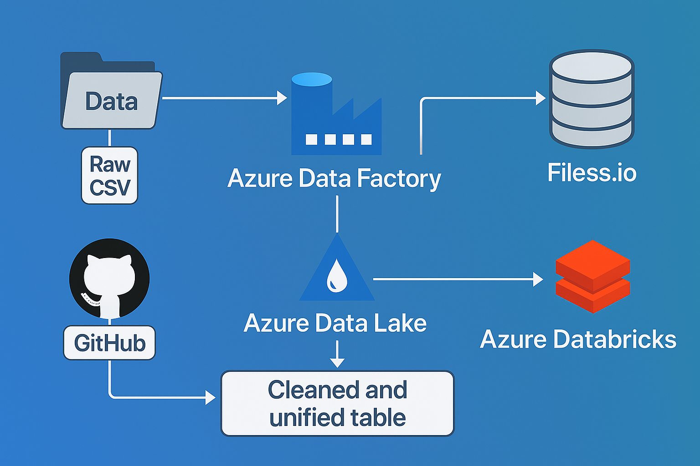

# **🛠️ End-to-End Data Engineering Pipeline on Azure**

## **📌 Project Overview**

This project demonstrates an end-to-end data engineering pipeline designed to explore how various Azure cloud platform resources work together to support scalable, cloud-native data processing workflows. The goal is to gain hands-on experience with Azure services and understand how to architect real-world data engineering solutions.

## **⚙️ Tools & Technologies Used**

| Resource               | Purpose                                                                                                       |
| ---------------------- | ------------------------------------------------------------------------------------------------------------- |
| **GitHub**             | Stores raw CSV files used for ingestion                                                                       |
| **Filess.io**          | Hosts both MySQL and MongoDB databases for structured and semi-structured data                                |
| **Azure Data Factory** | Orchestrates data ingestion from GitHub and Filess.io into Azure Data Lake                                    |
| **Azure Data Lake**    | Serves as the central data storage following the **Medallion Architecture** (Bronze, Silver, Gold layers)     |
| **Azure Databricks**   | Performs data processing, cleaning, and transformation using PySpark and SQL; creates a unified final dataset |

## **🎯 Objective**

This project was completed independently to:
* Understand the end-to-end flow of a real-time Data Engineering project 
* Explore key Azure resources and how they integrate within a cloud-based data pipeline 
* Apply best practices such as Medallion Architecture, modular processing, and cloud orchestration

## ** 🗂️ Project Flow**

This project follows a structured data engineering pipeline using the Azure ecosystem and external data sources:

ata-engineering-project/
* ├── README.md # Project overview and instructions
* ├── Data/ # Raw CSV files for ingestion into Filess.io and Azure Data Lake
* ├── data-factory/ # Azure Data Factory components
* │ ├── pipeline/ # Pipelines to orchestrate ingestion
* │ ├── linkedService/ # Linked services for GitHub and Filess.io
* │ └── dataset/ # Source and sink datasets
* ├── DataInjestionTables.ipynb # Google Colab notebook to ingest data into Filess.io SQL & MongoDB
* ├── Databricks Data Transformation.ipynb # Notebook for data cleaning and transformation in Azure Databricksta Transformation.ipynb      # Notebook for data cleaning and transformation in Azure Databricks

* Raw Data stored in Data/ (CSV files)
* Filess.io used to simulate MySQL and MongoDB for source databases
* DataInjestionTables.ipynb uploads CSV data into Filess.io databases via Google Colab
* Azure Data Factory ingests data from GitHub and Filess.io into Azure Data Lake
* Azure Databricks processes data and creates one final unified table for further analysis